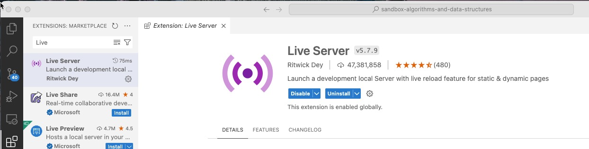
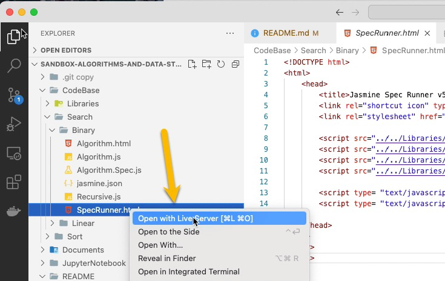
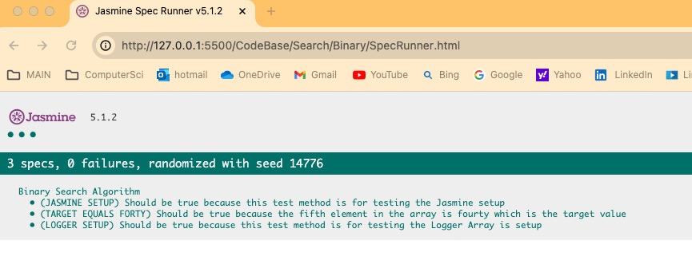
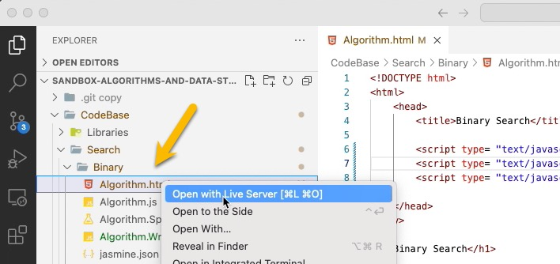

# sandbox-algorithms-and-data-structures

# How to launch jupyter notebook from a terminal

Jupyter Notebooks allow you to open IPYNB notebooks in the location you prefer. I generally recommend the following:     

* First create a folder at your preferred destination      
* Then go to terminal/cmd prompt and navigate to your above made destination      
* Once in the destination then type in **jupyter notebook**     

This will then automatically trigger the browser and open the Home tab, you can start a new notebook with your preferred kernel, rename and save the notebook, which it saves at the location where you navigated through the terminal

# Getting Started

To view the webpages I installed the **Live Server Plug** for the Miscrosoft Visual Studio Code.  

## Jasmine Test Framework

To runner the Jasmine Tests right click the the SpecRunner file and select **Open with LiveServer**.

Below is the Jasmine Test Webpage. 

## Run Appication

To run the applcaiton Right Click on the **Algorithm.html** and select **Open with LiveServer**.

# References
* [Jasmine Test Framework - Official Webpage Site](https://jasmine.github.io/)
* [JQuery Framework - Official Webpage Site](https://jquery.com/)
* [Binary Search – Data Structure and Algorithm Tutorials - geeksforgeeks.org](https://www.geeksforgeeks.org/binary-search/)